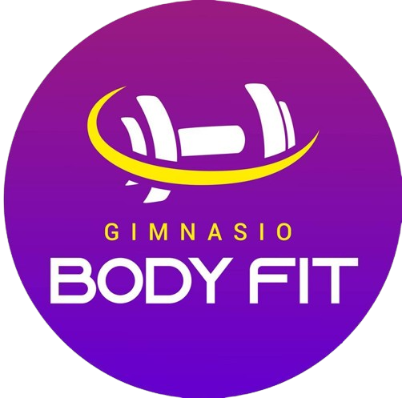

# **Sistema de Gestión para Gimnasios - BodyFit**

## **Características**

- Gestión de usuarios
- Control de membresías
- Interfaces con Bootstrap

## **Descripcion**
### Ordenadores hop
Nuestro proyecto es desarrollar un sistema de gestión y
registro de membresías para el gimnasio body fit, con el
objetivo de optimizar la atención al cliente y eliminar
el uso de registros físicos.

### Objetivos
-	Desarrollar un Sistema de Seguimiento de Cuotas que registre y monitoree los pagos de membresía de manera precisa, asegurando que los miembros estén al día con sus cuotas.
-	Diseñar y desarrollar un módulo que permita la actualización y organización eficiente de la información de los miembros, minimizando errores y duplicaciones.
-	Establecer Canales de Comunicación que faciliten la interacción con los miembros, promoviendo una mayor participación y satisfacción.
-	Realizar Pruebas de Usabilidad y Funcionalidad para evaluar la usabilidad y funcionalidad del sistema, asegurando que cumpla con los requisitos y expectativas de los usuarios finales.

## **Requisitos**

- PHP >= 7.4
- MySQL >= 5.7
